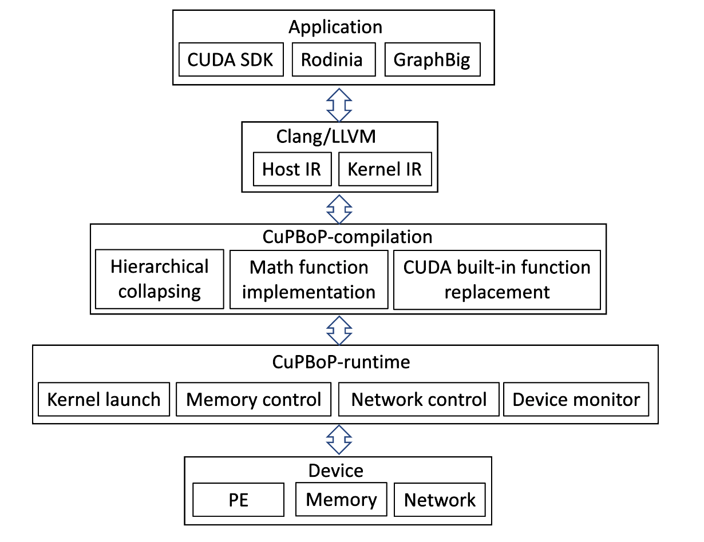

# The workflow of CuPBoP

The workflow of CuPBoP is described as following:

First, CuPBoP uses Clang to compile the CUDA source code into NVVM IR,
which consists of two parts: Host part and Kernel Part.
In the next step, CuPBoP-compilation parses and transforms these NVVM IRs
to make it suitable for executing on specific architectures.
The CuPBoP-runtime compiles the transformed Host IR and executes the generated programs,
which will compile the transformed Kernel IR and
upload the compiled kernel programs to specific architectures.
